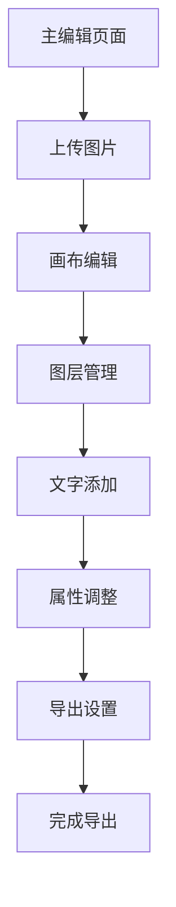

# 图片处理网页应用产品需求文档

## 1. Product Overview
基于React + Vite + Express技术栈的专业图片处理网页应用，支持多图层编辑、画布操作和批量导出功能。
- 解决用户在线图片编辑需求，支持多张图片堆叠处理和文字添加，提供专业级的图片编辑体验。
- 面向需要进行图片批量处理和设计的用户群体，提供便捷的在线编辑工具。

## 2. Core Features

### 2.1 User Roles
本应用为单用户模式，无需用户角色区分。

### 2.2 Feature Module
我们的图片处理应用包含以下主要页面：
1. **主编辑页面**：画布区域、工具栏、图层面板、属性面板
2. **导出页面**：批量导出设置、质量选择、文件夹选择

### 2.3 Page Details

| Page Name | Module Name | Feature description |
|-----------|-------------|---------------------|
| 主编辑页面 | 画布区域 | 显示图片编辑画布，支持图片拖拽、缩放、移动操作，图片边框控制（四角缩放，中心移动） |
| 主编辑页面 | 工具栏 | 图片上传按钮、文字工具、导出功能、字体选择器 |
| 主编辑页面 | 图层面板 | 显示所有图片图层，支持拖拽调整层级顺序，图层可见性控制，图层删除 |
| 主编辑页面 | 属性面板 | 选中图片/文字的属性编辑，包括位置、大小、透明度等参数 |
| 主编辑页面 | 文字输入框 | 文字内容输入，字体选择，文字拖拽移动，支持使用图片文件名作为文字内容 |
| 导出页面 | 导出设置 | 单张/批量导出选择，导出质量设置（高/中/低），目标文件夹选择 |
| 导出页面 | 压缩功能 | 批量导出时自动压缩为ZIP文件，单独导出直接保存图片文件 |

## 3. Core Process

主要用户操作流程：
1. 用户进入主编辑页面
2. 通过工具栏上传一张或多张图片到画布
3. 在画布中选择图片进行操作（拖拽移动、四角缩放）
4. 通过图层面板调整图片层级顺序
5. 使用文字工具添加文字，选择字体样式
6. 在属性面板中精确调整选中元素的属性
7. 完成编辑后选择导出功能
8. 设置导出参数（质量、文件夹）并执行导出

## 4. User Interface Design

### 4.1 Design Style
- 主色调：深蓝色 (#1890ff)，辅助色：浅灰色 (#f5f5f5)
- 按钮样式：圆角按钮，悬停效果
- 字体：系统默认字体，主要文字 14px，标题 16px
- 布局风格：左侧工具栏 + 中央画布 + 右侧面板的三栏布局
- 图标风格：线性图标，简洁现代

### 4.2 Page Design Overview

| Page Name | Module Name | UI Elements |
|-----------|-------------|-------------|
| 主编辑页面 | 工具栏 | 垂直排列的工具按钮，包含上传、文字、导出等功能，深色背景 #001529 |
| 主编辑页面 | 画布区域 | 白色背景画布，支持缩放和平移，选中图片显示蓝色边框和控制点 |
| 主编辑页面 | 图层面板 | 列表形式显示图层，支持拖拽排序，每个图层显示缩略图和名称 |
| 主编辑页面 | 属性面板 | 表单形式的属性编辑器，包含数值输入框和滑块控件 |
| 导出页面 | 导出设置 | 模态对话框形式，包含选项卡、文件夹选择器和质量滑块 |

### 4.3 Responsiveness
桌面优先设计，支持最小宽度 1200px 的屏幕，暂不考虑移动端适配。