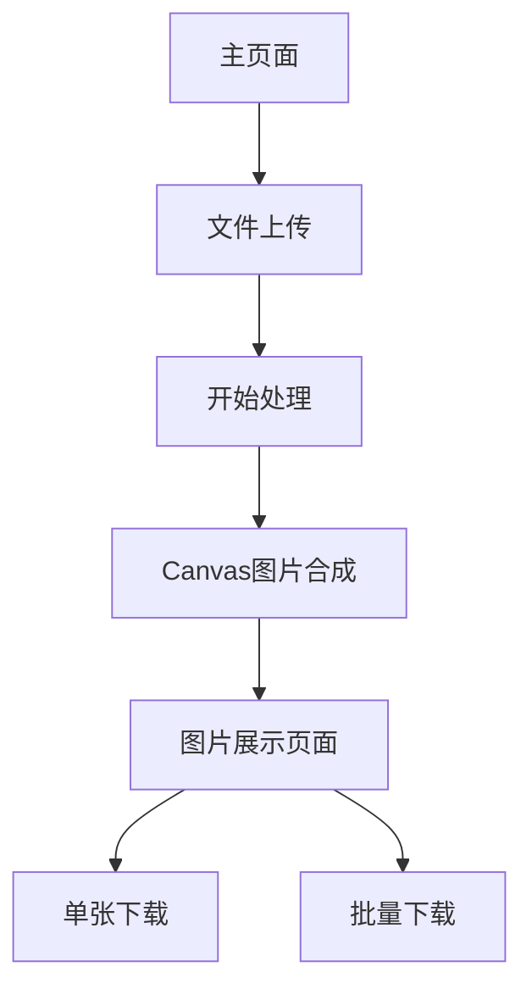

## 1. Product Overview
二维码图片处理工具是一个基于Web的图片合成应用，用于将背景图片与二维码图片进行批量合成处理。
- 解决医院或机构需要批量生成带有标识信息的二维码图片的问题，提高工作效率。
- 目标用户为需要批量处理二维码图片的工作人员，如医院管理员、营养师等。

## 2. Core Features

### 2.1 Feature Module
我们的二维码图片处理工具包含以下主要页面：
1. **主页面**：文件上传区域、图片处理控制台、处理进度显示
2. **图片展示页面**：处理结果网格展示、单张图片预览、批量下载功能

### 2.2 Page Details

| Page Name | Module Name | Feature description |
|-----------|-------------|---------------------|
| 主页面 | 文件上传区域 | 支持背景图片上传(bg.jpg)和多选二维码图片上传，文件格式验证 |
| 主页面 | 图片处理控制台 | 开始处理按钮、处理进度显示、错误信息提示 |
| 主页面 | Canvas处理引擎 | 图片加载、Canvas绘制、文字渲染(使用font.otf字体)、图片合成 |
| 图片展示页面 | 结果网格展示 | 响应式网格布局展示所有处理完成的图片 |
| 图片展示页面 | 图片预览功能 | 单张图片查看、图片名称显示、单张下载 |
| 图片展示页面 | 批量操作 | 全选功能、批量下载、清空结果 |

## 3. Core Process

用户操作流程：
1. 用户访问主页面，上传背景图片(bg.jpg)
2. 用户选择多个二维码图片文件(10f目录下的图片)
3. 点击"开始处理"按钮，系统开始批量处理
4. 系统使用Canvas将背景图片与每个二维码进行合成，在二维码上方添加文字标签
5. 处理完成后，在图片展示区域显示所有合成结果
6. 用户可以单张预览、单张下载或批量下载所有图片

## 4. User Interface Design

### 4.1 Design Style
- 主色调：青蓝色(#17a2b8)，辅助色：白色(#ffffff)、浅灰色(#f8f9fa)
- 按钮样式：圆角按钮，悬停效果，禁用状态区分
- 字体：系统默认字体，处理后图片使用font.otf自定义字体
- 布局风格：卡片式布局，响应式网格设计
- 图标风格：简洁的线性图标，支持上传、下载、处理等操作

### 4.2 Page Design Overview

| Page Name | Module Name | UI Elements |
|-----------|-------------|-------------|
| 主页面 | 文件上传区域 | 拖拽上传框，文件选择按钮，上传进度条，文件列表显示 |
| 主页面 | 处理控制台 | 蓝色处理按钮，进度条，状态文字提示，错误信息红色显示 |
| 图片展示页面 | 网格展示 | 3-4列响应式网格，卡片阴影效果，图片缩略图，标题文字 |
| 图片展示页面 | 操作按钮 | 绿色下载按钮，批量操作工具栏，清空按钮 |

### 4.3 Responsiveness
产品采用移动端优先的响应式设计，支持桌面端和移动端访问，针对触摸操作进行优化。