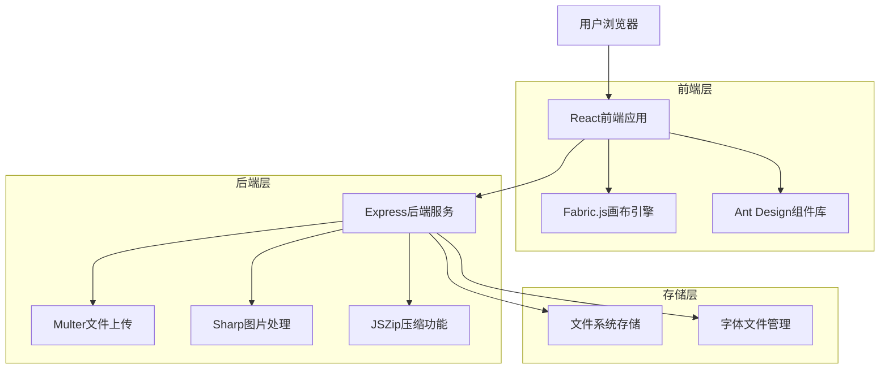
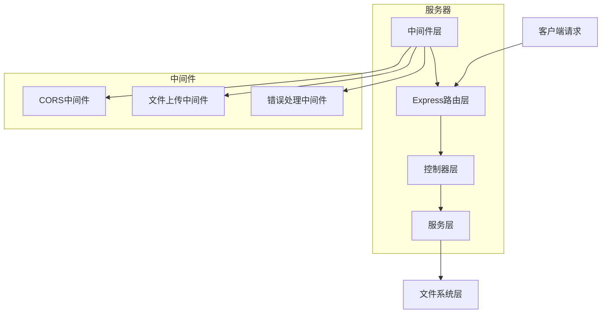
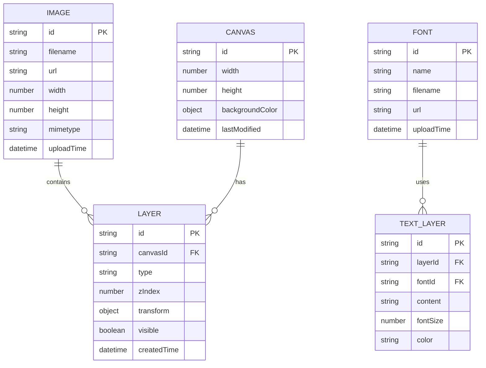

# 图片处理网页应用技术架构文档

## 1. Architecture design



## 2. Technology Description

* 前端：React\@18 + Vite\@4 + Ant Design\@5 + Fabric.js\@5

* 后端：Express\@4 + Multer\@1.4 + Sharp\@0.32 + JSZip\@3.10

* 开发工具：TypeScript\@5 + ESLint + Prettier

* 包管理：cnpm（用户指定）

## 3. Route definitions

| Route   | Purpose                  |
| ------- | ------------------------ |
| /       | 主编辑页面，包含画布、工具栏、图层面板等核心功能 |
| /export | 导出设置页面（可选，也可以用模态框实现）     |

## 4. API definitions

### 4.1 Core API

图片上传接口

```
POST /api/upload
```

Request (multipart/form-data):

| Param Name | Param Type | isRequired | Description |
| ---------- | ---------- | ---------- | ----------- |
| images     | File\[]    | true       | 上传的图片文件数组   |

Response:

| Param Name       | Param Type | Description |
| ---------------- | ---------- | ----------- |
| success          | boolean    | 上传是否成功      |
| data             | object\[]  | 上传成功的图片信息数组 |
| data\[].id       | string     | 图片唯一标识      |
| data\[].url      | string     | 图片访问URL     |
| data\[].filename | string     | 原始文件名       |
| data\[].width    | number     | 图片宽度        |
| data\[].height   | number     | 图片高度        |

字体文件上传接口

```
POST /api/fonts/upload
```

Request (multipart/form-data):

| Param Name | Param Type | isRequired | Description |
| ---------- | ---------- | ---------- | ----------- |
| font       | File       | true       | CSS字体文件     |

Response:

| Param Name | Param Type | Description |
| ---------- | ---------- | ----------- |
| success    | boolean    | 上传是否成功      |
| data       | object     | 字体信息        |
| data.name  | string     | 字体名称        |
| data.url   | string     | 字体文件URL     |

获取已安装字体列表

```
GET /api/fonts
```

Response:

| Param Name   | Param Type | Description |
| ------------ | ---------- | ----------- |
| success      | boolean    | 请求是否成功      |
| data         | object\[]  | 字体列表        |
| data\[].name | string     | 字体名称        |
| data\[].url  | string     | 字体文件URL     |

图片导出接口

```
POST /api/export
```

Request:

| Param Name | Param Type | isRequired | Description         |
| ---------- | ---------- | ---------- | ------------------- |
| canvasData | string     | true       | 画布JSON数据            |
| quality    | number     | false      | 导出质量 0.1-1.0，默认0.8  |
| format     | string     | false      | 导出格式 png/jpeg，默认png |
| batch      | boolean    | false      | 是否批量导出，默认false      |

Response:

| Param Name  | Param Type | Description  |
| ----------- | ---------- | ------------ |
| success     | boolean    | 导出是否成功       |
| data        | object     | 导出结果         |
| data.url    | string     | 单张导出时的图片URL  |
| data.zipUrl | string     | 批量导出时的压缩包URL |

## 5. Server architecture diagram



## 6. Data model

### 6.1 Data model definition



### 6.2 Data Definition Language

由于使用文件系统存储，不需要传统数据库DDL。数据结构以JSON格式存储：

图片信息存储结构

```json
{
  "id": "img_1234567890",
  "filename": "example.jpg",
  "url": "/uploads/images/img_1234567890.jpg",
  "width": 1920,
  "height": 1080,
  "mimetype": "image/jpeg",
  "uploadTime": "2024-01-01T00:00:00.000Z"
}
```

画布数据存储结构

```json
{
  "id": "canvas_1234567890",
  "width": 800,
  "height": 600,
  "backgroundColor": "#ffffff",
  "layers": [
    {
      "id": "layer_1234567890",
      "type": "image",
      "zIndex": 1,
      "imageId": "img_1234567890",
      "transform": {
        "x": 100,
        "y": 100,
        "scaleX": 1,
        "scaleY": 1,
        "rotation": 0
      },
      "visible": true
    },
    {
      "id": "layer_1234567891",
      "type": "text",
      "zIndex": 2,
      "content": "示例文字",
      "fontFamily": "Arial",
      "fontSize": 24,
      "color": "#000000",
      "transform": {
        "x": 200,
        "y": 200,
        "scaleX": 1,
        "scaleY": 1,
        "rotation": 0
      },
      "visible": true
    }
  ],
  "lastModified": "2024-01-01T00:00:00.000Z"
}
```

字体信息存储结构

```json
{
  "id": "font_1234567890",
  "name": "CustomFont",
  "filename": "custom-font.woff2",
  "url": "/uploads/fonts/font_1234567890.woff2",
  "uploadTime": "2024-01-01T00:00:00.000Z"
}
```

