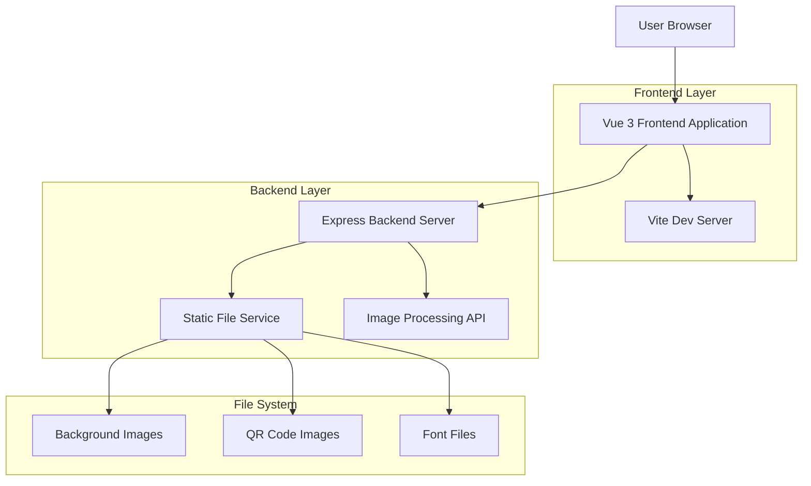
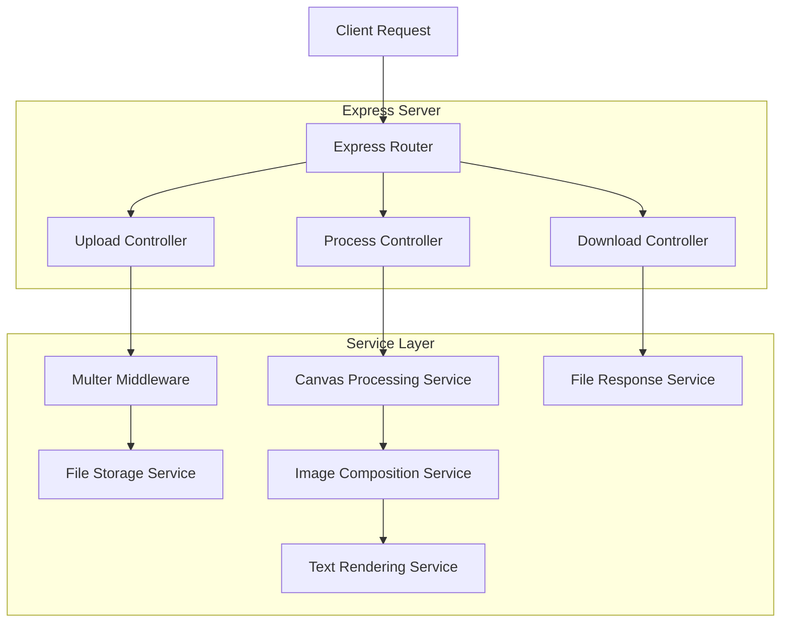
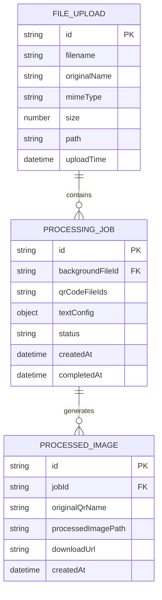

## 1.Architecture design



## 2.Technology Description

* Frontend: Vue\@3 + Vite\@4 + Canvas API + File API

* Backend: Express\@4 + Multer (file upload) + Sharp (image processing)

* Development: Node.js\@18+ + npm

## 3.Route definitions

| Route               | Purpose               |
| ------------------- | --------------------- |
| /                   | 主页面，包含文件上传和图片处理功能     |
| /api/upload         | 文件上传接口，处理背景图片和二维码图片上传 |
| /api/process        | 图片处理接口，执行Canvas合成操作   |
| /api/download/:id   | 单张图片下载接口              |
| /api/download/batch | 批量图片下载接口，返回ZIP文件      |
| /assets/\*          | 静态资源服务，包括字体文件和示例图片    |

## 4.API definitions

### 4.1 Core API

文件上传接口

```
POST /api/upload
```

Request (multipart/form-data):

| Param Name | Param Type | isRequired | Description    |
| ---------- | ---------- | ---------- | -------------- |
| background | File       | true       | 背景图片文件(bg.jpg) |
| qrCodes    | File\[]    | true       | 二维码图片文件数组      |

Response:

| Param Name | Param Type | Description |
| ---------- | ---------- | ----------- |
| success    | boolean    | 上传状态        |
| fileIds    | string\[]  | 上传文件的ID数组   |
| message    | string     | 响应消息        |

Example Response:

```json
{
  "success": true,
  "fileIds": ["bg_123", "qr_456", "qr_789"],
  "message": "文件上传成功"
}
```

图片处理接口

```
POST /api/process
```

Request:

| Param Name   | Param Type | isRequired | Description     |
| ------------ | ---------- | ---------- | --------------- |
| backgroundId | string     | true       | 背景图片文件ID        |
| qrCodeIds    | string\[]  | true       | 二维码图片文件ID数组     |
| textConfig   | object     | true       | 文字配置(字体、大小、颜色等) |

Response:

| Param Name     | Param Type | Description |
| -------------- | ---------- | ----------- |
| success        | boolean    | 处理状态        |
| results        | object\[]  | 处理结果数组      |
| processedCount | number     | 成功处理的图片数量   |

Example Request:

```json
{
  "backgroundId": "bg_123",
  "qrCodeIds": ["qr_456", "qr_789"],
  "textConfig": {
    "fontFamily": "CustomFont",
    "fontSize": 48,
    "color": "#000000",
    "strokeColor": "#ffffff",
    "strokeWidth": 4
  }
}
```

## 5.Server architecture diagram



## 6.Data model

### 6.1 Data model definition



### 6.2 Data Definition Language

由于这是一个轻量级的图片处理工具，我们使用文件系统存储而不是数据库。文件组织结构如下：

```
project/
├── uploads/           # 上传文件存储目录
│   ├── backgrounds/   # 背景图片
│   └── qrcodes/      # 二维码图片
├── processed/        # 处理后图片存储目录
├── temp/            # 临时文件目录
└── assets/          # 静态资源
    ├── fonts/       # 字体文件
    └── samples/     # 示例图片
```

文件命名规则：

* 上传文件：`{timestamp}_{originalName}`

* 处理后文件：`{jobId}_{qrName}_processed.jpg`

* 临时文件：`{uuid}_temp.{ext}`

